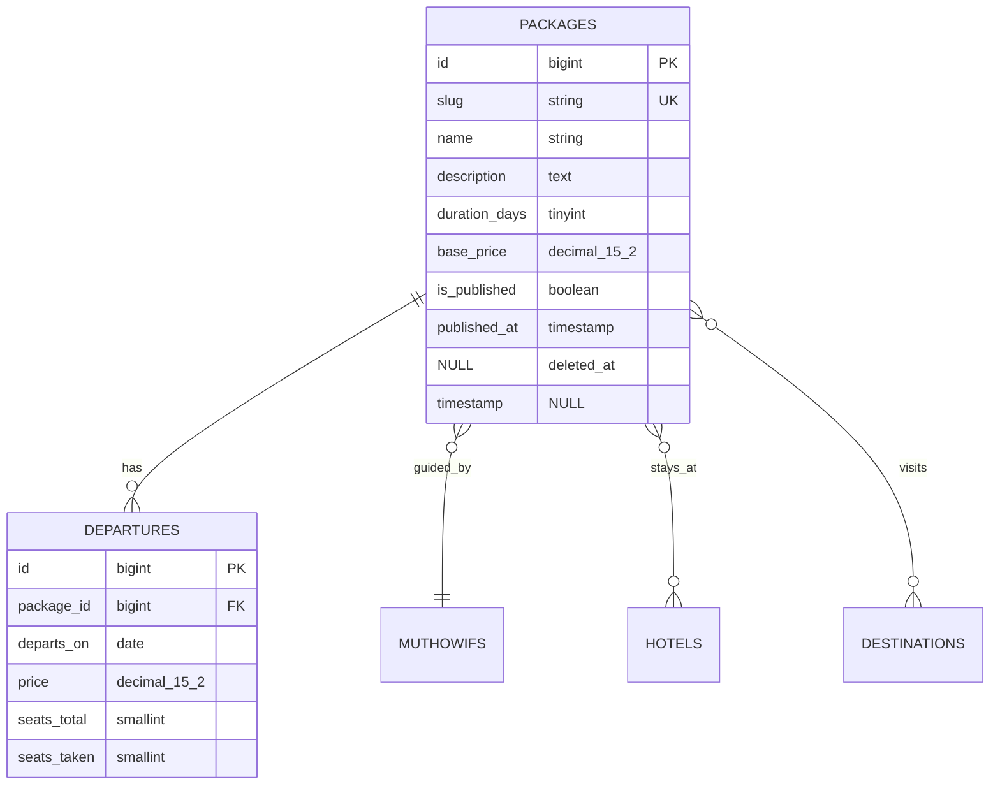

# Claude Skills — Laravel + Filament + Inertia React

Dua skill yang bikin Claude bisa membangun aplikasi Laravel lengkap dari deskripsi fitur, lalu menjaga UI-nya tetap konsisten sampai file ke-dua ratus.

Tiga skill ada di repo ini. **Pasang dua, jangan tiga.** Alasannya di [bagian bawah](#kenapa-skill-ketiga-jangan-dipasang-bersamaan).

---

## Daftar isi

- [Isi repo](#isi-repo)
- [Prasyarat](#prasyarat)
- [Cara pasang](#cara-pasang)
- [Memastikan skill terpasang](#memastikan-skill-terpasang)
- [Cara pakai — alur lengkap](#cara-pakai--alur-lengkap)
- [Contoh kasus lengkap: website travel umroh](#contoh-kasus-lengkap-website-travel-umroh)
- [Referensi script](#referensi-script)
- [Troubleshooting](#troubleshooting)
- [Kenapa skill ketiga jangan dipasang bersamaan](#kenapa-skill-ketiga-jangan-dipasang-bersamaan)
- [Batasan yang jujur](#batasan-yang-jujur)

---

## Isi repo

```
claude-skills-laravel/
├── laravel-app-builder.skill      ← pasang ini
├── ui-design-system.skill         ← pasang ini
├── laravel-filament-inertia.skill ← JANGAN pasang bersama dua di atas
│
├── install-these/                 (versi folder — sumber yang bisa diedit)
│   ├── laravel-app-builder/
│   │   ├── SKILL.md
│   │   ├── references/            (5 file, dibaca sesuai fase)
│   │   └── scripts/               bootstrap.sh, verify.sh
│   └── ui-design-system/
│       ├── SKILL.md
│       ├── references/            (4 file)
│       └── scripts/               audit-ui.sh
└── optional-superseded/
    └── laravel-filament-inertia/
```

File `.skill` adalah arsip zip siap pasang untuk aplikasi Claude. Folder di `install-these/` adalah sumbernya — **edit di situ**, lalu pasang ulang foldernya (atau kemas ulang `.skill`-nya).

### Apa beda kedua skill utama

| | `laravel-app-builder` | `ui-design-system` |
|---|---|---|
| Tugas | Bangun aplikasi dari deskripsi fitur | Jaga UI tetap konsisten |
| Kapan aktif | Kamu minta dibuatkan app / tambah fitur besar | Kamu bangun atau rapikan UI |
| Butuh terminal | **Ya** | Tidak (kecuali `audit-ui.sh`) |
| Output | Spec, ERD, migrasi, model, Action, Filament, halaman React, test | Token, primitives, patterns, audit drift |

Keduanya berdiri sendiri. Kamu boleh pasang salah satu saja.

---

## Prasyarat

| | Minimal | Cek |
|---|---|---|
| PHP | 8.2+ | `php -v` |
| Composer | 2.x | `composer -V` |
| Node | 18+ | `node -v` |
| npm | 9+ | `npm -v` |
| git | apa saja | `git --version` |

Untuk MCP (opsional tapi sangat disarankan): **Claude Code CLI**, cek dengan `claude --version`.

Script ditulis untuk **bash** + coreutils GNU/BSD. Jalan di Linux, macOS, WSL, dan Git Bash di Windows. Belum diuji di PowerShell murni.

Baseline yang diasumsikan (pertengahan 2026): Laravel 13.x, Filament v4 & v5, Inertia v2, Tailwind v4. Script tetap **memeriksa versi terpasang**, bukan berasumsi.

---

## Cara pasang

### A. Claude Code — untuk semua project (paling umum)

```bash
git clone https://github.com/incnajah/vibe-coding.git
cd vibe-coding

mkdir -p ~/.claude/skills
cp -r claude-skills-laravel/install-these/laravel-app-builder ~/.claude/skills/
cp -r claude-skills-laravel/install-these/ui-design-system    ~/.claude/skills/
```

### B. Claude Code — hanya untuk satu project

Taruh di `.claude/skills/` di dalam project, dan commit ke repo project supaya seluruh tim ikut memakainya:

```bash
mkdir -p .claude/skills
cp -r /path/ke/vibe-coding/claude-skills-laravel/install-these/laravel-app-builder .claude/skills/
cp -r /path/ke/vibe-coding/claude-skills-laravel/install-these/ui-design-system    .claude/skills/
```

Kalau nama sama ada di dua tempat, versi project menang.

### C. Claude.ai / aplikasi desktop Claude

Buka file `.skill`-nya, lalu klik **Save skill**:

- `claude-skills-laravel/laravel-app-builder.skill`
- `claude-skills-laravel/ui-design-system.skill`

Catatan penting: di chat claude.ai tidak ada terminal, jadi `laravel-app-builder` **tidak bisa** menjalankan loop build. Dia akan bilang begitu terus terang, lalu tetap menghasilkan spec, ERD, dan file kode yang bisa kamu salin. Untuk build otomatis sungguhan, pakai Claude Code atau Cowork.

### Kalau kamu mengedit skill-nya

Setelah mengubah isi `install-these/`, salin ulang foldernya. Untuk mengemas ulang `.skill`:

```bash
cd claude-skills-laravel/install-these
zip -r ../laravel-app-builder.skill laravel-app-builder
zip -r ../ui-design-system.skill    ui-design-system
```

Struktur di dalam zip harus punya satu folder di akar yang berisi `SKILL.md`.

---

## Memastikan skill terpasang

```bash
ls ~/.claude/skills/
# laravel-app-builder  ui-design-system
```

Di dalam sesi Claude Code, ketik `/` — skill yang terpasang muncul di daftar. Skill juga aktif otomatis lewat deskripsinya, jadi kamu tidak wajib memanggilnya dengan nama.

Kalau tidak muncul: pastikan setiap folder berisi `SKILL.md` **langsung di dalamnya** (bukan bersarang satu tingkat lagi), lalu mulai sesi Claude Code yang baru.

---

## Cara pakai — alur lengkap

Delapan langkah. Yang bertanda **kamu** butuh tindakanmu; sisanya dikerjakan Claude.

```
1. bootstrap.sh              → stack + MCP siap
2. cd ke PROJECT_ROOT        ← kamu
3. npx shadcn@latest init    ← kamu (interaktif, sekali saja)
4. deskripsikan fitur        ← kamu
5. review ERD                ← kamu (satu-satunya gate wajib)
6. arah visual → token       → ui-design-system
7. build loop per slice      → verify.sh tiap slice
8. audit-ui.sh sebelum commit
```

### Langkah 1 — bootstrap

Script tinggal **di dalam folder skill**, bukan di dalam project. Waktu build, direktori kerja adalah project, jadi `bash scripts/bootstrap.sh` tidak akan ketemu. Selalu pakai path skill-nya:

```bash
SKILL_DIR=~/.claude/skills/laravel-app-builder
bash "$SKILL_DIR/scripts/bootstrap.sh" travel-umroh
```

Script ini idempoten — aman diulang. Baris terakhir yang dicetak:

```
PROJECT_ROOT=/home/kamu/travel-umroh
```

### Langkah 2 — masuk ke project

`bootstrap.sh` berjalan di proses terpisah, jadi dia **tidak bisa** mengubah direktori kerja shell-mu. Kamu harus pindah sendiri:

```bash
cd travel-umroh
```

Semua perintah setelah ini dijalankan dari sini.

### Langkah 3 — shadcn/ui

Sengaja tidak dijalankan otomatis: prompt-nya interaktif dan akan menggantung loop otonom.

```bash
npx shadcn@latest init
npx shadcn@latest add button card dialog form input select
```

Tambahkan komponen seperlunya saja. `add` tiga puluh komponen sekaligus berarti tiga puluh file yang harus dirawat.

### Langkah 4 — deskripsikan fiturnya

Cukup bahasa biasa. Jangan repot menyusun schema — itu justru tugas skill-nya.

> Website travel umroh. Ada paket umroh, destinasi, muthowif, hotel, harga per tanggal keberangkatan, album foto, dan tombol WhatsApp langsung ke admin.

Claude akan menghasilkan tiga file di `docs/`:

| File | Isi |
|---|---|
| `docs/spec.md` | aktor, entitas, daftar fitur per slice, daftar out-of-scope |
| `docs/erd.md` | diagram Mermaid: semua tabel, kolom, tipe, nullability, relasi |
| `docs/plan.md` | urutan slice + kriteria penerimaan tiap slice |

Dia akan **menyimpulkan sendiri** hal-hal seperti soft delete, slug, timestamp, dan SEO field — tanpa bertanya. Yang ditanyakan maksimal tiga, dan hanya yang mahal kalau salah:

1. Uang — cuma tampil harga, atau ada pembayaran online sungguhan?
2. Multi-tenancy — satu organisasi atau banyak dengan data terpisah?
3. Akun pengunjung — publik perlu registrasi, atau cukup brosur + tombol kontak?

Kalau deskripsimu sudah menjawab salah satunya, dia tidak akan menanyakannya lagi.

### Langkah 5 — gate ERD

Ini **satu-satunya berhenti wajib**. Claude menampilkan ERD dan rencana slice, lalu bertanya sekali:

> Ini rencananya. Ada yang salah atau kurang sebelum aku bangun?

Baca ERD-nya. Dua menit di sini menghemat berjam-jam rework, karena schema yang salah menjalar ke migrasi, model, Action, resource Filament, dan halaman React sekaligus.

Kalau kamu memang tidak mau ditanya, bilang **"langsung saja"** atau **"one shot"** di prompt awal — gate-nya dilewati, ERD tetap ditulis ke disk, dan build jalan terus.

### Langkah 6 — arah visual jadi token

Tentukan dulu arah estetiknya (pakai skill `frontend-design` kalau tersedia, atau sepakati sendiri warna dan tipografinya). Lalu `ui-design-system` menerjemahkannya jadi token di `resources/css/app.css`:

```css
@theme {
  --color-primary:       oklch(0.55 0.18 255);
  --color-primary-fg:    oklch(0.99 0 0);
  --color-surface:       oklch(1 0 0);
  --color-surface-muted: oklch(0.97 0.005 260);
  --color-content:       oklch(0.22 0.01 260);
  --color-danger:        oklch(0.58 0.20 25);
}
```

Nama **peran**, bukan nama warna. `--color-danger` selamat dari rebranding; `--color-red-500` jadi kebohongan begitu brand-nya berubah, dan tidak ada yang berani mengganti namanya karena sudah dipakai di sembilan puluh file.

Lakukan ini **sebelum** membangun komponen. Fitur pertama bikin tombolnya sendiri, fitur kedua bikin yang mirip tapi beda, dan di fitur kelima tidak ada lagi sistem yang bisa dipasang surut.

### Langkah 7 — loop build

Claude membangun **slice demi slice**, bukan layer demi layer. Satu slice = satu fitur utuh dari database sampai UI. Artinya aplikasi selalu dalam keadaan bisa didemokan; kalau per-layer, tidak ada yang jalan sampai akhir.

Per slice:

1. Migration + model + factory + seeder
2. Action class berisi business logic
3. Test Pest terhadap Action — **ditulis sebelum UI**
4. Filament resource
5. Inertia controller + halaman React
6. `bash "$SKILL_DIR/scripts/verify.sh"`
7. Kalau gagal: baca error sungguhan, perbaiki, ulangi

Batas loop **6 percobaan per slice**. Di kegagalan ke-6 dia berhenti dan melapor — teks error, apa saja yang sudah dicoba, dan dugaan penyebabnya. Loop yang diam-diam berputar di masalah tak terpecahkan cuma membakar waktu dan token.

Tiap slice yang lulus di-commit sendiri, jadi kamu punya titik rollback per fitur.

### Langkah 8 — audit sebelum commit

```bash
SKILL_DIR=~/.claude/skills/ui-design-system
bash "$SKILL_DIR/scripts/audit-ui.sh"
```

Exit 1 kalau ada temuan HIGH, jadi bisa langsung dipasang sebagai gate CI.

---

## Contoh kasus lengkap: website travel umroh

Skenario nyata dari awal sampai serah terima.

### 1. Bootstrap

```bash
SKILL_DIR=~/.claude/skills/laravel-app-builder
bash "$SKILL_DIR/scripts/bootstrap.sh" travel-umroh
cd travel-umroh
npx shadcn@latest init
```

Yang barusan terpasang: Laravel + Filament panel + Inertia/React/TypeScript + Tailwind v4 + Ziggy + Media Library + Pest + Larastan + Debugbar, SQLite sudah siap, Inertia sudah **benar-benar terhubung** (middleware terdaftar di `bootstrap/app.php`, `app.blade.php`, `app.tsx`, `vite.config.js`, `tsconfig.json`), `git init` + commit pertama, dan MCP terdaftar.

Kalau ada yang gagal, script mencetak blok **Degraded capabilities** — misalnya Playwright tidak terdaftar, artinya verifikasi cuma lewat test, bukan browser sungguhan. Dia tidak menyembunyikannya.

### 2. Deskripsi

> Website travel umroh. Paket umroh, destinasi, muthowif, hotel, harga per tanggal keberangkatan, album foto, tombol WhatsApp langsung.

### 3. Yang disimpulkan tanpa bertanya

- `packages` jadi entitas pusat; sisanya menggantung padanya
- "harga" bukan atribut paket, tapi milik tabel `departures` — harga variatif per tanggal itu hampir universal di bisnis ini
- "album foto" = media polimorfik lewat Media Library, bukan tabel berisi path gambar
- WhatsApp = generator link dengan template pesan, bukan integrasi messaging
- Admin perlu auth; pengunjung tidak
- Tiap entitas konten dapat `slug`, `is_published`, `sort_order`, timestamps, soft delete
- Field SEO di semua yang punya URL publik

Yang **ditanyakan** cuma: pembayaran online atau tidak. (Jawab "tidak, cukup WhatsApp" → tidak ada tabel `orders`, `payments`, `invoices`.)

### 4. ERD yang muncul di gate



Uang selalu `decimal(15,2)` atau integer satuan terkecil — **tidak pernah** `float`. Tiap FK dapat index dan perilaku `onDelete` yang eksplisit.

Kamu jawab misalnya: *"muthowif bisa lebih dari satu per paket"* → ERD direvisi jadi many-to-many, baru build jalan.

### 5. Slice yang dibangun

```
✓ Slice 1/6 — Auth + admin panel shell
✓ Slice 2/6 — Packages: migration, model, 4 Actions, 11 tests, Filament resource, /paket + detail
✓ Slice 3/6 — Departures: harga & kursi per tanggal, relation manager
✓ Slice 4/6 — Muthowif, hotel, destinasi + pivot
✓ Slice 5/6 — Galeri foto (Media Library) + tombol WhatsApp
▸ Slice 6/6 — SEO, sitemap, halaman 404
```

Business logic tidak pernah tinggal di dalam Filament resource maupun controller. Keduanya cuma pemanggil tipis:

```php
final class PublishPackage
{
    public function __construct(private CacheRepository $cache) {}

    public function handle(Package $package): Package
    {
        $package->update(['published_at' => now()]);
        $this->cache->forget('packages.published');
        PackagePublished::dispatch($package);

        return $package->fresh();
    }
}
```

Filament memanggilnya:

```php
Action::make('publish')
    ->requiresConfirmation()
    ->action(fn (Package $record, PublishPackage $publish) => $publish->handle($record));
```

Kenapa penting: publish harus menstempel `published_at`, membersihkan cache, dan mengirim notifikasi — urutan yang sama persis, mau dipicu dari admin atau dari controller. Kalau logikanya ditaruh di dalam resource, pemanggil kedua diam-diam mengerjakan lebih sedikit. Bug jenis ini tidak melempar error; dia cuma menghasilkan data yang salah.

### 6. Saat verify gagal

```
▸ Tests
  ✗ pest

VERIFY FAILED: pest
Fix the FIRST failure above, then re-run. Do not start the next slice.
```

Claude membaca error sungguhan (`storage/logs/laravel.log`, `php artisan tinker`, atau MCP laravel-boost untuk melihat schema live), memperbaiki, lalu mengulang. **Kegagalan pertama saja** yang dibaca — kegagalan verifikasi itu beruntun, dan "memperbaiki" keempatnya berarti tiga perubahan spekulatif pada kode yang sebetulnya tidak rusak.

Kalau error yang sama muncul tiga kali meski perbaikannya berbeda, itu tanda diagnosisnya yang salah, bukan patch-nya yang kurang variasi.

### 7. Serah terima

```bash
bash "$SKILL_DIR/scripts/verify.sh" --full
```

Lalu `README.md` project ditulis lengkap dengan langkah setup, kredensial admin, dan akun demo yang sudah di-seed. Laporan akhirnya menyebut apa yang dibangun per slice, apa yang sengaja tidak dibangun, **apa yang masih rusak** (disebut pertama, tidak pernah dikubur), dan tiga hal berikutnya yang layak dikerjakan.

Aplikasi tidak pernah dilaporkan selesai kalau `verify.sh` masih merah. "8 dari 10 slice jalan, checkout gagal di X" jauh lebih berguna daripada ringkasan hijau yang ketahuan bohong begitu kamu buka browser.

---

## Referensi script

### `bootstrap.sh`

```bash
bash "$SKILL_DIR/scripts/bootstrap.sh" [nama-project]
```

| | |
|---|---|
| Argumen | nama project. Boleh dikosongkan **hanya** kalau sudah ada `./artisan` di direktori sekarang |
| Idempoten | ya — tiap langkah dilewati kalau sudah ada |
| Output penting | baris terakhir `PROJECT_ROOT=…`, dan blok **Degraded capabilities** kalau ada yang gagal |
| Exit 1 | ada prasyarat yang hilang (dilaporkan sekaligus, bukan satu per satu) |

Yang **tidak** dijalankan: `npx shadcn@latest init` (interaktif) dan `php artisan boost:install` versi interaktif (akan menggantung loop otonom). Keduanya dicetak sebagai perintah untuk kamu jalankan.

### `verify.sh`

```bash
bash "$SKILL_DIR/scripts/verify.sh" [--full]
```

Dijalankan **dari root project**, bukan dari folder skill. Kalau tidak ada `./artisan`, dia berhenti dengan exit 2.

| Cek | Kapan |
|---|---|
| PHP syntax (`app`, `database`, `routes`, `tests`) | selalu |
| Migrasi jalan | selalu |
| Route resolve | selalu |
| Pest / PHPUnit | selalu |
| Vite build | selalu |
| PHPStan (advisory, tidak memblokir) | `--full` |
| `filament:optimize` | `--full` |
| Smoke HTTP `/` dan `/admin/login` | `--full` |

| Exit | Arti |
|---|---|
| 0 | lulus |
| 1 | ada yang gagal — nama kegagalannya disebut |
| 2 | salah pemakaian (bukan di root project, atau argumen tidak dikenal) |

Server dev untuk smoke test dimatikan bersih lewat `trap`, termasuk kalau script-nya diinterupsi — jadi port-nya tidak nyangkut ke run berikutnya. Ganti portnya dengan `VERIFY_PORT=9000` kalau 8899 bentrok.

### `audit-ui.sh`

```bash
bash "$SKILL_DIR/scripts/audit-ui.sh" [source-dir] [css-dir]
```

Default: `resources/js` dan `resources/css`.

| Temuan | Peringkat |
|---|---|
| Hex mentah di komponen | HIGH |
| Warna Tailwind arbitrary (`bg-[#3b82f6]`) | HIGH |
| `focus:outline-none` tanpa `focus-visible` pengganti | HIGH |
| `<div onClick>` | HIGH |
| Komponen duplikat / lebih dari satu Button | HIGH |
| Tidak ada blok `@theme` sama sekali | HIGH |
| Warna inline style, spacing/font arbitrary, z-index arbitrary | MED |
| `` tanpa `alt`, `<button>` mentah di luar `ui/` | MED |
| Token bernama literal (`--color-blue-500`) | MED |
| Skala spacing terlalu lebar, `dark:` sedikit | LOW |

Exit 1 kalau ada HIGH. Contoh pemakaian di CI:

```yaml
- name: Design system audit
  run: bash .claude/skills/ui-design-system/scripts/audit-ui.sh
```

---

## Troubleshooting

**`bash: scripts/bootstrap.sh: No such file or directory`**
Path relatif tidak akan pernah resolve — direktori kerja adalah project, script-nya ada di folder skill. Pakai `SKILL_DIR`. Cari lokasinya kalau ragu:
```bash
ls -d ~/.claude/skills/laravel-app-builder .claude/skills/laravel-app-builder 2>/dev/null
```

**`bad interpreter: /usr/bin/env bash^M`**
Script kena konversi CRLF. Repo ini memasang `.gitattributes` yang mengunci `*.sh` ke LF, jadi seharusnya tidak terjadi. Kalau terlanjur: `sed -i 's/\r$//' script.sh`.

**`verify.sh must run from the Laravel project root`**
Kamu masih di direktori induk. `cd` ke `PROJECT_ROOT` yang dicetak `bootstrap.sh`.

**`no usable test runner (pest needs tests/Pest.php)`**
`bootstrap.sh` menjalankan `pest --init`, tapi kalau gagal jalankan sendiri: `vendor/bin/pest --init`.

**403 di `/admin` waktu produksi**
`canAccessPanel()` belum diimplementasikan di model `User`. Ini bukan bug Filament — tanpa itu, panel diblokir di luar environment `local`.

**Style Filament rusak setelah deploy**
`php artisan filament:assets` belum jalan di pipeline deploy, atau CSS aplikasi ikut dimasukkan ke panel. Filament dan frontend punya build Tailwind sendiri-sendiri dan **tidak boleh** digabung — preset-nya berbeda dan akan saling merusak.

**Port 8899 sudah dipakai**
`VERIFY_PORT=9000 bash "$SKILL_DIR/scripts/verify.sh" --full`

**MCP tidak terdaftar**
Butuh Claude Code CLI. Cek `claude mcp list`. Kehilangan Playwright berarti verifikasi hanya lewat test; kehilangan laravel-boost berarti API harus dicek ke dokumentasi, bukan ke aplikasi yang berjalan. Keduanya melambatkan, tidak mematikan.

---

## Kenapa skill ketiga jangan dipasang bersamaan

`laravel-filament-inertia` adalah versi pertama, dan isinya sudah dilebur ke `laravel-app-builder/references/architecture.md`. Deskripsi trigger-nya sudah dipersempit jadi "guidance saja, tanpa build loop", tapi cakupan stack-nya tetap sama persis.

Kalau keduanya aktif, triggering jadi tidak bisa diprediksi: kadang yang satu, kadang yang lain, kadang keduanya masuk konteks dan saling mengulang.

Pasang dia **hanya** kalau kamu mau panduan arsitektur ringan tanpa mesin build otonom. Pilih salah satu.

---

## Batasan yang jujur

- **Bagian instalasi paket di `bootstrap.sh` belum pernah dijalankan end-to-end** di environment dengan PHP + Composer lengkap. Logika preflight, patch `bootstrap/app.php` (diuji pada bentuk Laravel 11 dan 12), serta `verify.sh` dan `audit-ui.sh` sudah diuji. Jalankan sekali di direktori kosong sebelum kamu andalkan.
- Belum diuji di PowerShell murni — pakai Git Bash atau WSL di Windows.
- Skill **tidak** memasang MCP diam-diam. `bootstrap.sh` menjalankan perintahnya dan melaporkan mana yang gagal.
- Skill **tidak** memasang skill lain. Keduanya self-contained. Yang benar-benar mem-publish skill tambahan ke dalam project adalah `php artisan boost:install`.
- `ui-design-system` mengurus **sistem**, bukan selera. Untuk arah estetik pakai skill desain seperti `frontend-design` kalau tersedia; skill ini merujuk ke sana dan tidak menggantikannya.
