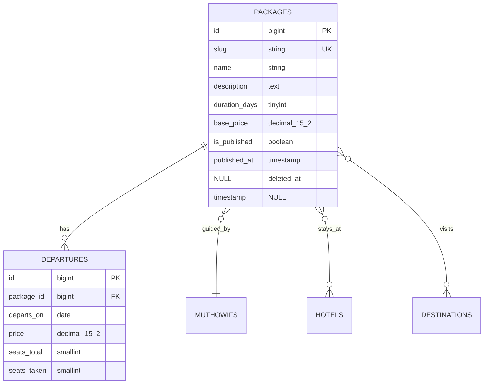

# Requirements → Specification → ERD

The goal of this phase is to convert a paragraph of features into a schema good enough to build on, **without a requirements interview**. The user hired an agent to avoid that interview.

## Inference over interrogation

A feature list implies far more than it states. Extract it rather than asking.

**Example.** User says: *"Website travel umroh, ada paket umroh, destinasi, muthowif, hotel, harga, album foto, dan tombol WhatsApp langsung."*

What is stated: six nouns and one integration.

What is inferable and must not be asked:
- `packages` is the central entity; everything else hangs off it
- `destinations`, `muthowifs`, `hotels` are reference entities, many-to-many or many-to-one with packages
- "harga" is an attribute of package, not an entity — unless there are departure dates, in which case price belongs to a `departures` table (variable pricing per date is near-universal in this business, so model it that way)
- "album foto" means polymorphic media, not a table of image paths — use a media library
- WhatsApp is a link generator with a message template, not a messaging integration
- Admin needs auth; public visitors do not
- Every content entity needs `slug`, `is_published`, `sort_order`, timestamps, and soft deletes
- SEO fields (`meta_title`, `meta_description`) on anything with a public URL

None of that warrants a question. Decide it, write it in the ERD, and let the user correct it at the gate.

## What actually deserves a question

Only decisions that are expensive to reverse *and* cannot be inferred from context:

1. **Money handling** — display-only prices, or real online payment? These produce completely different schemas.
2. **Multi-tenancy** — one organization or many, each with isolated data? Retrofitting tenancy is a rewrite.
3. **End-user accounts** — does the public side need registration, or is it a brochure site with a contact action?

Ask at most these three, in one message, and skip any the description already answers. A description mentioning "customers can track their booking" has already answered #3.

## Output 1 — docs/spec.md

```markdown
# <App> — Specification
## Actors
- Guest: browses, contacts via WhatsApp
- Admin: manages all content

## Entities
| Entity | Purpose | Key fields |
|---|---|---|

## Slices (build order)
1. <slice> — acceptance: <observable condition>

## Out of scope (v1)
- <thing>: <why>
```

The out-of-scope list is not filler. It is what stops the build from expanding indefinitely and what the user reads when they wonder why payments are missing.

## Output 2 — docs/erd.md

Mermaid, with real types and nullability. Vague ERDs produce vague migrations.



Rules that prevent predictable pain:
- Money is `decimal(15,2)` or integer minor units. Never `float`.
- Every FK gets an index and an explicit `onDelete` behaviour.
- Enums as PHP backed enums cast on the model, not raw strings scattered through the code.
- Anything user-facing and addressable gets a unique `slug`.
- Pivot tables carrying data (`nights`, `sort_order`) get their own model.

## Output 3 — docs/plan.md

Slices ordered so that each one leaves the app demonstrable. Each needs an acceptance criterion phrased as something observable, not as a task.

Bad: "Build package management."
Good: "Admin can create a package with photos and departures; it appears on `/paket` and its detail page renders."

The difference matters because the acceptance criterion is what the verification loop checks against. A criterion that cannot fail is not a criterion.

## Slice ordering

1. Auth + admin panel shell (everything depends on it)
2. Core entity, end to end (proves the whole vertical works)
3. Reference entities and their relations
4. Remaining public pages
5. Cross-cutting: search, filters, SEO, sitemap
6. Polish: seeders with realistic data, error pages, 404 handling

Never order slices as "all migrations, then all models, then all controllers." Layer-first ordering means nothing is testable until the very end, which is precisely when a compounding error is most expensive to find.
