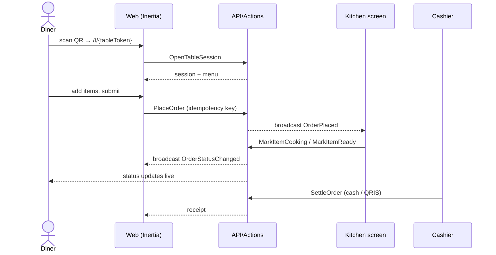
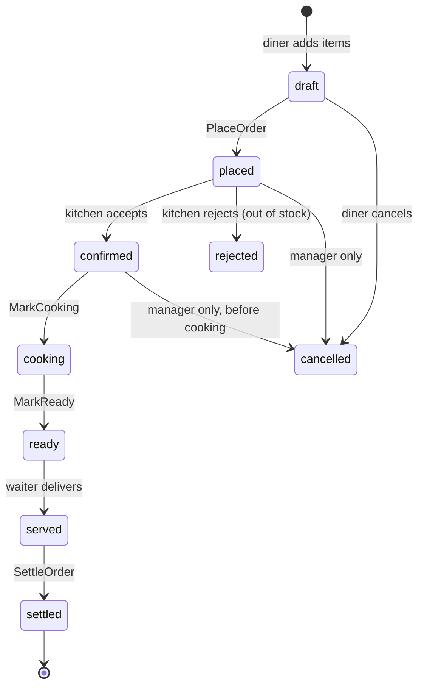

# Workflow Modeling — Apps That Are Processes, Not Catalogues

An ERD is enough for a catalogue. It is not enough for a process.

A travel site is entity-shaped: packages, hotels, destinations. Nothing moves. Model the entities, build CRUD, done.

A restaurant ordering system is process-shaped. One order moves through four different people — the diner scans a QR code, the kitchen sees a ticket, the cashier takes payment, the diner watches a status change — and **the interesting part is the movement, not the row.** Build that from an ERD alone and you get four screens that each edit an `orders` table, with no agreement on what "paid" means, no guarantee the kitchen ever sees the order, and a status column that any screen can set to anything.

This file is how to avoid that. Read it during Phase 1, before the ERD is final.

## Is this app process-shaped?

Ask three questions of the user's description. Any **yes** means process-shaped.

1. **Do two or more different roles act on the same record, in sequence?**
   "QR per meja → kasir → koki → pelanggan" is four roles on one order. Yes.
2. **Does a record have a lifecycle where the allowed actions depend on where it is?**
   You cannot pay for an order that was cancelled. You cannot cook one that was not confirmed. Yes.
3. **Does someone need to be told when something changes, without refreshing?**
   The kitchen must not poll a printout. Yes.

Entity-shaped apps skip this file. Process-shaped apps produce one extra document before any code.

## Output — `docs/workflows.md`

Write it alongside `docs/prd.md` and `docs/erd.md`. Four sections.

### 1. Actor map

Who acts, on what device, under what conditions. This is not filler — it constrains the entire design.

```markdown
| Actor    | Device            | Auth            | Network        |
|----------|-------------------|-----------------|----------------|
| Diner    | own phone, QR     | none — table token | mall wifi, flaky |
| Waiter   | shared tablet     | PIN             | wifi           |
| Kitchen  | fixed screen      | device-bound    | wired          |
| Cashier  | POS terminal      | PIN + shift     | wired          |
| Owner    | laptop, Filament  | password        | anywhere       |
```

"Diner has no account, identified by a table token" changes the auth model, the ERD, and the security review. It is the kind of thing that must be decided before the first migration, not discovered at slice 5.

### 2. Journey per actor — sequence diagrams

One per primary journey. Mermaid, so it renders anywhere.



The value is in what it forces you to notice. This one surfaces four decisions the prose never mentioned: the diner needs a session before ordering, `PlaceOrder` needs an idempotency key, the kitchen works per *item* not per order, and payment is a separate action from ordering.

### 3. State machine per stateful entity

Every entity that moves gets one. Draw it, list the transitions, and name who is allowed to trigger each.



Then the table that the code is actually built from:

```markdown
| From      | To        | Action class      | Who              | Guard                      |
|-----------|-----------|-------------------|------------------|----------------------------|
| draft     | placed    | PlaceOrder        | diner            | ≥1 item, table open        |
| placed    | confirmed | ConfirmOrder      | kitchen          | all items available        |
| confirmed | cancelled | CancelOrder       | manager          | nothing has started cooking|
| ready     | served    | MarkServed        | waiter           | —                          |
| served    | settled   | SettleOrder       | cashier          | payment recorded           |
```

**Every row becomes one Action class.** Not a generic `updateStatus($order, $status)` — that is a state machine with no rules, and it will be called from a Filament resource with the wrong value within a week.

Rules that prevent the predictable failures:

- The state column is a **PHP backed enum**, cast on the model. Never a loose string.
- A transition Action **validates the current state first** and throws on an illegal move. `settled → cooking` must be impossible to express, not merely unlikely.
- Guards live in the Action, not in the UI. The UI hides the button; the Action is what actually stops it. Hiding a button is not authorization.
- Every transition that others care about **fires an event**. That is the seam realtime and notifications hang off.
- Log transitions to a history table if anyone will ever ask "who cancelled this and when." In hospitality and payments, they always ask.

### 4. Events and realtime

A table, decided deliberately — not "we'll add websockets later."

```markdown
| Event              | Who must know      | How              | If it fails       |
|--------------------|--------------------|------------------|-------------------|
| OrderPlaced        | kitchen, cashier   | broadcast        | kitchen polls 10s |
| OrderStatusChanged | diner              | broadcast        | diner polls 15s   |
| ItemOutOfStock     | all open sessions  | broadcast        | shows on reload   |
| OrderSettled       | owner dashboard    | none — on reload | —                 |
```

**Decide push versus poll explicitly, and be honest about it.** Broadcasting (Laravel Reverb + Echo) is a real service to run, monitor, and reconnect. Polling every ten seconds is one line, costs almost nothing at twenty tables, and cannot silently disconnect.

The rule: a kitchen screen genuinely needs push — a missed ticket is a real cost. A diner's status display is fine with polling. An owner's dashboard needs neither. Choosing websockets for all three because one of them needs it is how a small restaurant app acquires an operations problem.

**Always specify the fallback.** A websocket that drops and never reconnects is worse than polling, because nobody notices.

## The failures worth designing against

These are what actually break process apps in production. Every one of them belongs in the workflow doc, not discovered later.

**Double submit.** A diner on bad mall wifi taps "Order" twice. Without an idempotency key on `PlaceOrder`, that is two orders and one angry table. Generate the key client-side, store it, and make the second call return the first result.

**Concurrent transitions.** The kitchen marks an item ready while the cashier settles the bill. Both read, both write, one wins silently. Use a database transaction plus a state check inside it, or optimistic locking on a version column.

**Stale screens.** The kitchen display has been open for nine hours. Its websocket dropped at hour three. Design the reconnect and a periodic full refresh, or the screen quietly stops being true.

**Unattended devices.** The QR table token is in a URL a diner can share, screenshot, or use tomorrow. Scope it: bind it to an open table session, expire it when the table settles, and never let it read another table's data.

**Money.** Payment is a separate entity from an order, with its own states. An order is not "paid" because a boolean was set — it is settled because a payment record exists with an amount and a method. Never `float`; `decimal(15,2)` or integer minor units.

**Offline.** If the network is genuinely unreliable, decide whether the diner can compose an order offline and submit later, or whether the app simply refuses and says so clearly. Both are acceptable. Silently losing the basket is not.

## Slice ordering for process apps

Different from the entity-shaped ordering, because the process is the risk.

1. **Auth, roles, admin shell** — everything sits on it
2. **The state machine, with tests and no UI at all** — every transition, every guard, every illegal move rejected. This is where the design gets proven, and it is cheap to change here
3. **The happy path end to end, one actor at a time** — diner orders, kitchen sees it, cashier settles
4. **The unhappy paths** — cancel, reject, out of stock, refund
5. **Realtime**, replacing the polling fallback where the table above says push
6. **Reporting and the owner's dashboard**

Building step 2 before any UI is what makes the rest fast. The state machine is the whole application; the screens are just four windows onto it. Getting it wrong after the screens exist means changing four screens instead of one Action.

## The documents stay alive

`docs/prd.md`, `docs/erd.md`, and `docs/workflows.md` are not written once and abandoned. The build discovers things the plan could not.

When implementation contradicts a document — a transition that turns out to be impossible, a role that needs an action the table did not grant, an event nobody actually needs — **update the document in the same commit as the code**, and add one line to `docs/decisions.md` saying what changed and why.

A workflow diagram that no longer matches the code is worse than no diagram, because the next person trusts it. Keeping them in sync is cheap while building and expensive afterwards.
