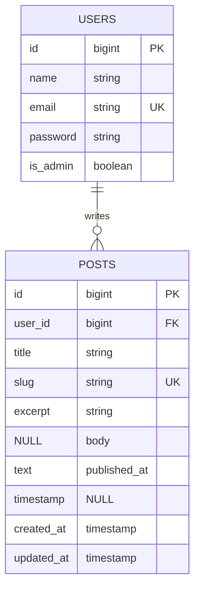

# ERD

- `slug` unik dan berindeks — dipakai sebagai URL publik.
- `published_at` null berarti draft. Tanggal, bukan boolean, supaya urutan terbit
  bisa diketahui dan penjadwalan mungkin ditambahkan tanpa migrasi.
- `user_id` berindeks dengan `onDelete('cascade')`.
